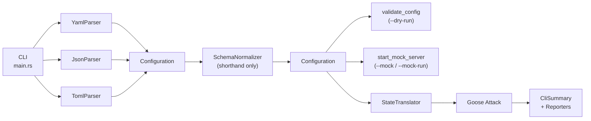
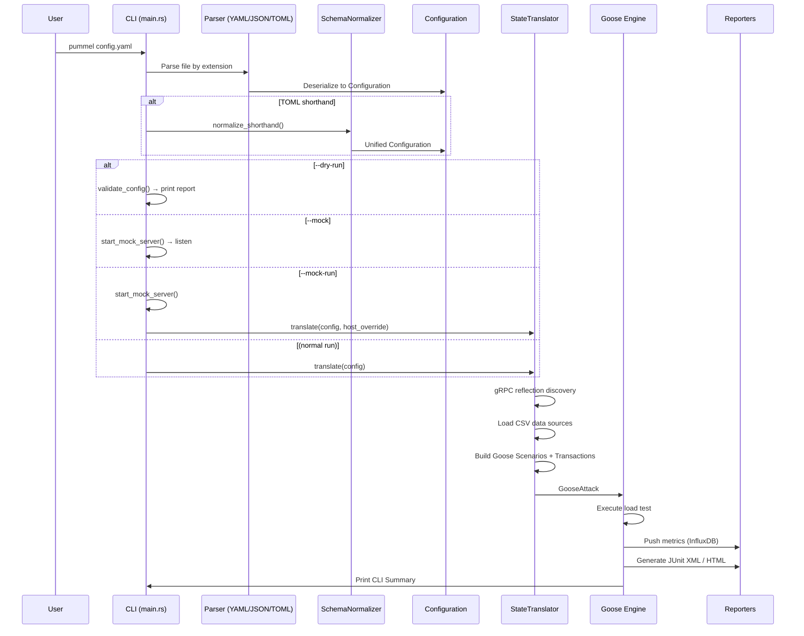
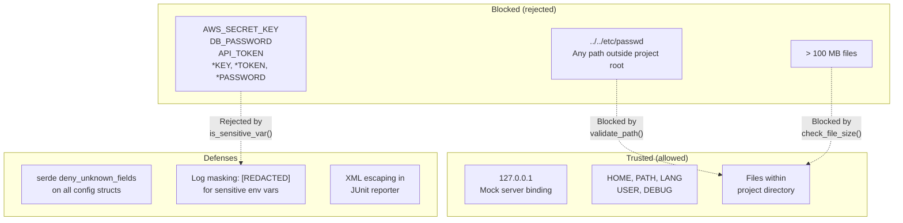

# pummel

> A high-performance, protocol-agnostic load generator that bridges Taurus YAML configurations with a Rust-native attack engine.

[](https://opensource.org/licenses/Apache-2.0)
[](https://www.rust-lang.org/)

## Why This Exists

Performance testing tools are either easy to configure (JMeter, k6) or fast (custom Go/Rust harnesses), but rarely both. `pummel` lets you define complex multi-protocol scenarios in familiar Taurus YAML and execute them with near-zero overhead via the Goose engine — no JVM, no Node runtime, no container orchestration required.

## Quick Start

```bash
git clone https://github.com/py-centric/pummel.git
cd pummel
cargo build --release
```

Create a config file `load_test.yaml`:

```yaml
execution:
  - concurrency: 10
    ramp-up: 5s
    hold-for: 30s
    scenario: smoke-test

scenarios:
  smoke-test:
    requests:
      - url: http://localhost:8080/api/health
      - url: http://localhost:8080/api/users
        method: POST
        body: '{"name": "test-user"}'
```

Run it:

```bash
./target/release/pummel load_test.yaml
```

## Installation

**Prerequisites**: Rust 2024+ toolchain.

```bash
# Install Rust if you don't have it
curl --proto '=https' --tlsv1.2 -sSf https://sh.rustup.rs | sh

# Clone and build
git clone https://github.com/py-centric/pummel.git
cd pummel
cargo build --release
```

Binary: `./target/release/pummel`.

**Optional optimization** for maximum load generation performance:

```bash
RUSTFLAGS="-C target-cpu=native" cargo build --release
```

## CLI Reference

```
Usage: pummel [OPTIONS] <CONFIG>

Arguments:
  <CONFIG>  Path to the configuration file (.yaml, .yml, .json, .toml)

Options:
  -d, --dry-run    Validate configuration and dependencies without executing
  -m, --mock       Start an internal mock server based on the configuration
      --mock-run   Start the mock server and run the configuration against it
  -h, --help       Print help
  -V, --version    Print version
```

### `--dry-run`

Validates the configuration, checks that data source files exist, verifies the config translates to a Goose attack, and scans for sensitive environment variable references — all without sending any traffic.

```bash
pummel --dry-run load_test.yaml
```

Output:

```
[OK] Parsing configuration
[OK] Normalizing configuration
[OK] Verifying data-source: users.csv
[OK] Translating to Goose Attack
Validation Successful.
```

### `--mock`

Starts a protocol-aware mock server (HTTP via Axum, gRPC via Tonic) that simulates backend responses based on assertion definitions in your config. The server binds to `127.0.0.1` (localhost only) on random ports.

```bash
pummel --mock load_test.yaml
# Mock server started at http://127.0.0.1:54321
# gRPC Mock server started at 127.0.0.1:54322
# Press Ctrl+C to stop.
```

### `--mock-run`

Starts the mock server **and** runs the load test against it automatically. The host is overridden to point at the mock server — no real backend needed.

```bash
pummel --mock-run load_test.yaml
```

## Configuration Formats

`pummel` supports three configuration formats, all producing the same internal representation.

### YAML (Taurus-compatible)

```yaml
execution:
  - concurrency: 50
    ramp-up: 30s
    hold-for: 5m
    scenario: api-test
    pacing:
      rate: 100
      per: 1s
      randomize: true

scenarios:
  api-test:
    think-time: 200ms
    headers:
      Authorization: Bearer ${env.API_TOKEN}
    data-sources:
      - users.csv
      - path: products.csv
        delimiter: ";"
        loop_data: true
    requests:
      - url: /api/login
        method: POST
        label: login
        body: '{"user": "${email}", "pass": "${password}"}'
        timeout: 10s
        assert:
          - contains: ["token"]
            subject: body
        extract-jsonpath:
          auth_token: $.token

      - url: /api/users/${auth_token}
        method: GET
        label: get-user

reporting:
  - module: influxdb
    url: http://influxdb:8086
    bucket: load_tests
    token: ${env.INFLUX_TOKEN}
    interval: 10s
  - module: junit-xml
    filename: results.xml
    sla:
      - metric: avg-response-time
        threshold: 500.0
        action: warn
      - metric: fail-rate
        threshold: 0.10
        action: stop
```

### JSON

```json
{
  "execution": [{
    "concurrency": 10,
    "ramp-up": "5s",
    "hold-for": "30s",
    "scenario": "basic"
  }],
  "scenarios": {
    "basic": {
      "requests": [
        "http://example.com/health",
        {
          "url": "/api/data",
          "method": "GET",
          "label": "get-data"
        }
      ]
    }
  }
}
```

### TOML (Shorthand)

The TOML format supports a compact shorthand where scenario names with dot notation (e.g., `auth.search`) automatically inherit parent requests as `on_start` steps:

```toml
[execution]
concurrency = 10
ramp-up = "10s"
hold-for = "1m"
scenario = "auth.search"

[scenarios]
auth = { requests = ["/login"] }
"auth.search" = { requests = ["/search"] }
```

## Protocol Support

| Feature | HTTP/S | WebSocket | gRPC (Dynamic) |
| :--- | :---: | :---: | :---: |
| **Methods** | GET, POST, PUT, DELETE, PATCH, HEAD, OPTIONS | Text frames | Unary, Server-Stream, Client-Stream, Bidi-Stream |
| **Assertions** | Body/Status | Message Content | Response Message |
| **Extraction** | JSONPath/Regex/XPath | Regex/XPath | Regex |
| **Mocking** | Integrated (Axum) | Integrated (Axum) | Integrated (Tonic) |
| **Real-time Metrics** | Yes | Yes | Yes |

### Dynamic gRPC

`pummel` uses gRPC server reflection to discover service schemas at runtime. No `.proto` files or code generation required.

```yaml
scenarios:
  streaming_test:
    requests:
      - url: grpc://localhost:50051
        protocol: grpc
        method-name: my.service.v1.RealtimeService/GetStatus
        grpc-mode: server-streaming
        body: '{"id": "user-123"}'
        assert:
          - contains: ["ACTIVE"]
            subject: body
```

`grpc-mode` supports: `unary` (default), `server-streaming`, `client-streaming`, `bidi-streaming`.

### WebSocket Testing

```yaml
scenarios:
  chat_test:
    requests:
      - url: ws://localhost:8080/ws
        protocol: websocket
        message: "Hello Server"
        assert:
          - contains: ["Welcome"]
```

### XPath Extraction

Extract variables from XML responses (e.g., SOAP services):

```yaml
requests:
  - url: https://api.example.com/soap
    extract-xpath:
      token: "//auth:Session/token/text()"
    assert:
      - contains: ["Success"]
```

## Reporting

### CLI Summary

A terminal-friendly summary table is **always** printed after a test run:

```
==========================================================================================
  PUMMEL LOAD TEST SUMMARY
==========================================================================================
  Duration: 30s  |  Max Users: 50  |  Total Requests: 15234  |  Failures: 12 (0.1%)
------------------------------------------------------------------------------------------
  Method   Path                                     Requests    Fails    Avg(ms)  p95(ms)  p99(ms)
------------------------------------------------------------------------------------------
  POST     /api/login                                  5120        0      45.2     89.3    142.1
  GET      /api/users/abc123                           5044        8      32.1     67.8    105.4
  GET      /api/health                                 5070        4       5.1     12.3     21.7
------------------------------------------------------------------------------------------
```

### InfluxDB

Real-time metric pushes during the test and a final summary push:

```yaml
reporting:
  - module: influxdb
    url: http://influxdb:8086
    bucket: load_tests
    token: ${env.INFLUX_TOKEN}
    interval: 10s   # push every 10 seconds during the test
```

### JUnit XML

Post-test XML report for CI/CD integration:

```yaml
reporting:
  - module: junit-xml
    filename: results.xml
```

### HTML Report

Goose-native HTML report:

```yaml
reporting:
  - module: html
    filename: report.html
```

## Architecture

`pummel` follows a modular pipeline optimized for async concurrency. The core flow is:



### Engine Modules

All engine modules live under `src/engine/`:

```mermaid
graph TB
    subgraph "Engine Modules"
        MOD goose["goose.rs<br/>Orchestration & execution"]
        MOD trans["translator/<br/>Config → Goose Attack"]
        MOD cf["control_flow.rs<br/>AssertionEngine + ControlFlowEngine"]
        MOD ext["extraction.rs<br/>JSONPath / Regex / XPath"]
        MOD interp["interpolation.rs<br/>${var} substitution"]
        MOD macro["macros.rs<br/>faker / uuid / env vars"]
        MOD env["env.rs<br/>EnvironmentLoader"]
        MOD pacing["pacing.rs<br/>PacingEngine"]
        MOD sla["sla.rs<br/>SlaEngine"]
        MOD ds["data_sources.rs<br/>CSV + path validation"]
        MOD reporting["reporting.rs<br/>CLI / JUnit / InfluxDB"]
        MOD mock["mock.rs<br/>Axum + Tonic mock server"]
        MOD validation["validation.rs<br/>Dry-run validation"]
        MOD grpc["grpc_dynamic.rs<br/>gRPC reflection"]
        MOD utils["utils.rs<br/>Time parsing"]
        MOD proto["proto/<br/>Protobuf definitions"]
    end

    goose --> trans
    goose --> reporting
    goose --> sla
    trans --> cf
    trans --> ext
    trans --> interp
    trans --> macro
    trans --> ds
    trans --> pacing
    trans --> grpc
    macro --> env
    mock --> proto
    grpc --> proto
```

### Data Flow



### Security Boundaries



Key security measures:

- **Mock server**: Binds to `127.0.0.1` only (never `0.0.0.0`)
- **Sensitive env vars**: Blocked by pattern matching (`AWS_*`, `SECRET*`, `*_KEY`, `*_TOKEN`, `*_PASSWORD`, `DATABASE_URL`, `DB_*`, `PRIVATE*`). Values masked as `[REDACTED]` in logs
- **Path traversal**: All file reads (CSV data sources, body files) validated to stay within the project directory
- **File size limits**: Data sources and body files capped at 100 MB
- **Config validation**: `#[serde(deny_unknown_fields)]` on all configuration structs rejects typos at parse time
- **XML injection**: JUnit reporter escapes user-controlled strings

## Chaos Engineering

`pummel` natively supports chaos engineering workflows with lifecycle hooks, real-time SLA breach actions, and a dynamic control API.

```yaml
# Inject chaos with Toxiproxy during the test
services:
  - module: shell
    prepare:
      - toxiproxy-cli create db_proxy -l 0.0.0.0:13306 -u db:3306
    startup:
      - toxiproxy-cli toxic add -t latency -a latency=500 db_proxy
    shutdown:
      - toxiproxy-cli delete db_proxy

# Auto-rollback on SLA breach
reporting:
  - module: junit-xml
    sla:
      - metric: avg-response-time
        threshold: 500.0
        action: "exec:curl -X POST http://rollback/api/undo"

# Live metrics & remote abort
api:
  enabled: true
  port: 8000
```

The control API exposes `GET /metrics` (live JSON metrics) and `POST /control/stop` (graceful shutdown), binding to `127.0.0.1` only.

## Error Handling

`pummel` uses structured error types (`PummelError`) with tagged variants for precise diagnostics:

| Variant | Description |
|---------|-------------|
| `[IO]` | File system errors with context |
| `[SERDE]` | Deserialization failures with optional file path and source chain |
| `[GOOSE]` | Underlying Goose engine errors |
| `[VALIDATION]` | Configuration field validation failures |
| `[MOCK]` | Mock server startup errors |
| `[NETWORK]` | Connection failures with host/operation details |
| `[SLA]` | SLA threshold breaches |
| `[ENV]` | Blocked sensitive environment variables |
| `[NOT IMPLEMENTED]` | Features not yet available |
| `[INTERNAL]` | Internal assertion failures |

## Contributing

See [CONTRIBUTING.md](CONTRIBUTING.md) if it exists, otherwise:

1. Fork the repository
2. Create a feature branch (`git checkout -b feature/my-feature`)
3. Write tests before implementation
4. Ensure `cargo clippy`, `cargo fmt --check`, and `cargo test` pass
5. Submit a pull request

## License

Apache License 2.0. See [LICENSE](LICENSE) for details.
