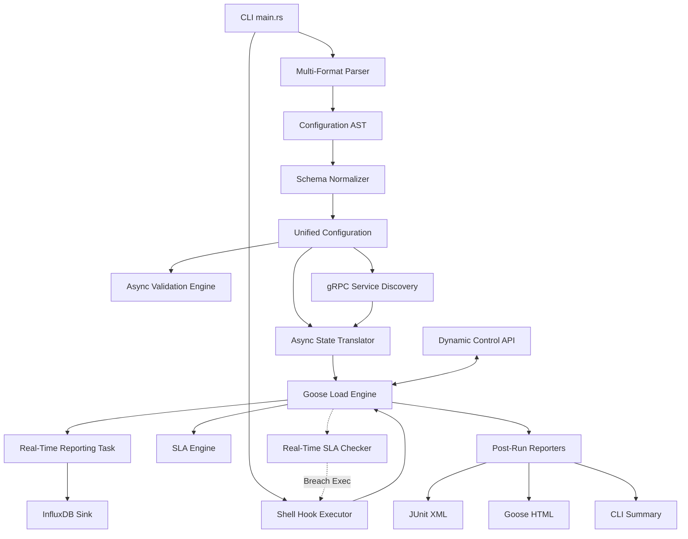
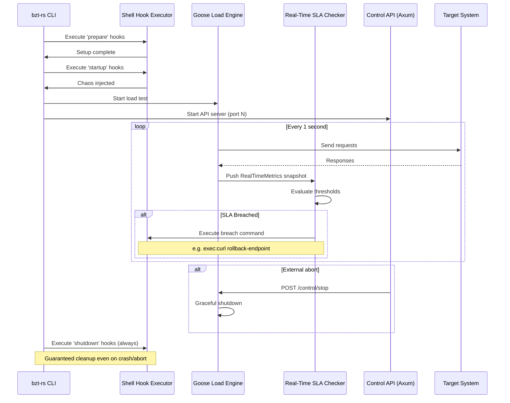

# bzt-rs Architecture

`bzt-rs` is designed as a modular, high-throughput pipeline that transforms high-level performance specifications into highly concurrent asynchronous tasks.

## Orchestration Flow



## Core Components

### 1. Multi-Format Parser & Normalizer
Supports **YAML**, **JSON**, and **TOML** (including an optimized shorthand). The normalizer resolves dot-notation inheritance (e.g., `auth.search`), ensuring that parent initialization requests are correctly injected as `on_start` steps in child scenarios.

### 2. Async Validation & Security
Performs a non-destructive dry-run of the configuration.
*   **Security Layer**: Enforces path traversal checks, file size limits (100MB), and redacts sensitive environment variables (`SECRET*`, `TOKEN`, `KEY`, etc.) from all logs.
*   **Path Validation**: Ensures all CSV data sources and body files exist and are reachable before the attack starts.

### 3. Dynamic gRPC Engine
Uses `prost-reflect` and `tonic-reflection` to enable **Generic gRPC** support.
*   **Reflection Phase**: Queries the target gRPC server for service descriptors during translation.
*   **Generic Codec**: Dynamically serializes JSON payloads into binary Protobuf and deserializes responses without pre-compiled code.
*   **Streaming**: Supports unary and server-side streaming modes asynchronously.

### 4. Async State Translator
The bridge between the static AST and the dynamic Goose engine. It builds `Goose` transactions that manage:
*   **Session State**: Per-user `UserSession` with variable storage.
*   **Interpolation**: Real-time `${var}` and `${env.VAR}` substitution.
*   **Macro Execution**: Dynamic data generation using `fake` and `uuid`.
*   **Protocol Dispatch**: Routing traffic to HTTP, WebSocket, or gRPC clients.

### 5. Real-Time Observability
*   **InfluxDB Reporter**: A dedicated background task that consumes metrics from shared state and flushes them to InfluxDB.
*   **Distributed Sync**: Every worker node is tagged with a unique `worker_id` (UUID), ensuring correct metric aggregation during distributed "Gaggle" runs.

### 6. Logic & Extraction Engines
*   **Control Flow**: Implements complex branching and looping logic with numeric comparison and boolean operator support.
*   **Extraction**: Multi-engine variable capture supporting **JSONPath**, **Regex**, and **XPath 2.0** (via `sxd-xpath`).

### 7. Integrated Mock Server
A multi-protocol test utility (Axum for HTTP/WS, Tonic for gRPC) that allows for isolated, assertion-based scenario verification.

### 8. Chaos Engineering Support

`bzt-rs` provides first-class chaos engineering primitives that let you inject faults, observe system behaviour under stress, and automatically react to SLA breaches—all from a single YAML file.

#### Chaos Engineering Lifecycle



#### Shell Hook Executor

The `services` block defines shell commands that run at well-known lifecycle phases:

*   **`prepare`** – Runs before the load test starts. Use for provisioning infrastructure, seeding databases, or configuring network partitions.
*   **`startup`** – Runs after `prepare` completes and just before traffic begins. Use for injecting latency, killing sidecar processes, or toggling feature flags.
*   **`shutdown`** – **Always** runs when the test finishes, even on `SIGINT`, `SIGTERM`, or an internal panic. This guarantees cleanup of any chaos experiments (e.g., restoring iptables rules, restarting stopped services).

#### Real-Time SLA Breach Actions

A dedicated background thread polls the shared `RealTimeMetrics` snapshot every **1 second**. When a threshold is breached, the configured `exec:` command fires immediately. This enables reactive patterns such as:

*   Automatically rolling back a canary deployment when p99 latency exceeds the budget.
*   Paging an on-call engineer via a webhook when error rate spikes.
*   Triggering a circuit-breaker endpoint on the target system.

#### Dynamic Control API

An optional **Axum HTTP server** starts alongside the load test, exposing two endpoints:

| Endpoint             | Method | Description                                      |
| -------------------- | ------ | ------------------------------------------------ |
| `/metrics`           | `GET`  | Returns a live JSON snapshot of current metrics.  |
| `/control/stop`      | `POST` | Initiates a graceful shutdown of the load test.   |

The API enables external orchestrators (CI pipelines, Kubernetes operators, dashboards) to observe and control a running test without filesystem or signal access.

#### Example Configuration

```yaml
execution:
  - concurrency: 50
    ramp-up: 30s
    hold-for: 5m
    scenario: chaos-test

scenarios:
  chaos-test:
    default-address: http://target-service:8080
    requests:
      - url: /api/health
        method: GET

services:
  - module: shell
    prepare:
      - toxiproxy-cli create db_proxy -l 0.0.0.0:13306 -u db:3306
    startup:
      - toxiproxy-cli toxic add -t latency -a latency=500 db_proxy
    shutdown:
      - toxiproxy-cli delete db_proxy

reporting:
  - module: junit-xml
    sla:
      - metric: p95-response-time
        threshold: 2000.0
        action: "exec:curl -X POST http://deploy-api/rollback"
      - metric: fail-rate
        threshold: 0.10
        action: stop

api:
  enabled: true
  port: 9090
```

## Performance Profile
By leveraging Rust's `tokio` runtime and the `goose` engine, `bzt-rs` maintains a near-zero CPU/memory footprint compared to Java or Python-based alternatives, while providing significantly deeper protocol control.
