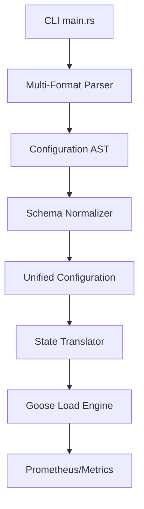

# bzt-rs Architecture

## Components

1. **Multi-Format Parser**: Deserializes YAML, JSON, and TOML.
2. **Schema Normalizer**: Bridges "Shorthand" and Taurus schemas.
3. **State Translator**: Maps AST to dynamic Goose scenarios and tasks.
4. **Goose Load Engine**: High-performance Rust-based execution.
