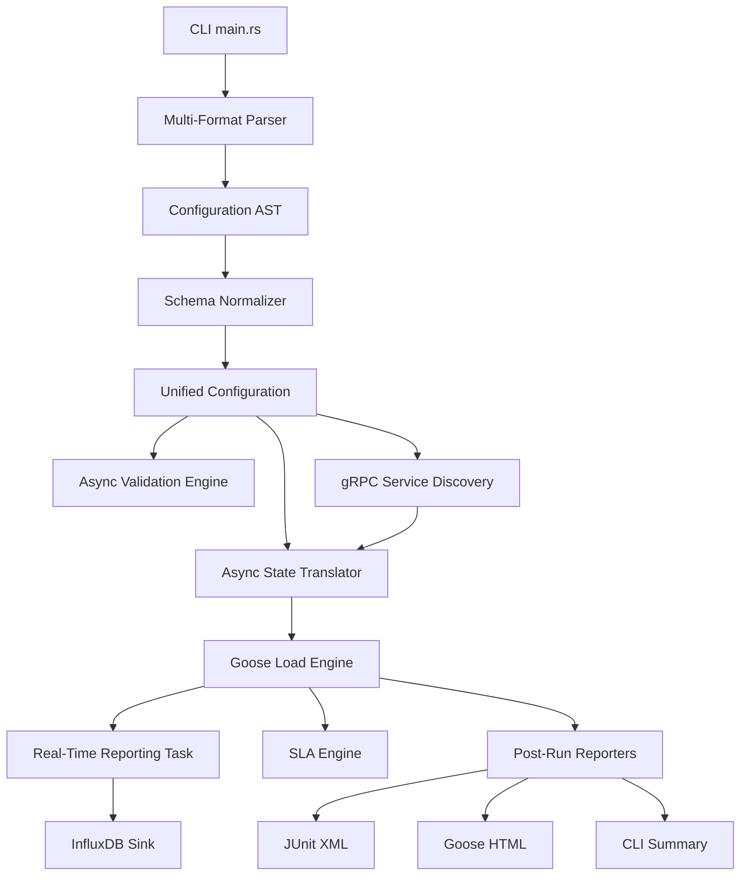

# bzt-rs Architecture

`bzt-rs` is designed as a modular, high-throughput pipeline that transforms high-level performance specifications into highly concurrent asynchronous tasks.

## Orchestration Flow

## Core Components

### 1. Multi-Format Parser & Normalizer
Supports **YAML**, **JSON**, and **TOML** (including an optimized shorthand). The normalizer resolves dot-notation inheritance (e.g., `auth.search`), ensuring that parent initialization requests are correctly injected as `on_start` steps in child scenarios.

### 2. Async Validation & Security
Performs a non-destructive dry-run of the configuration.
*   **Security Layer**: Enforces path traversal checks, file size limits (100MB), and redacts sensitive environment variables (`SECRET*`, `TOKEN`, `KEY`, etc.) from all logs.
*   **Path Validation**: Ensures all CSV data sources and body files exist and are reachable before the attack starts.

### 3. Dynamic gRPC Engine
Uses `prost-reflect` and `tonic-reflection` to enable **Generic gRPC** support.
*   **Reflection Phase**: Queries the target gRPC server for service descriptors during translation.
*   **Generic Codec**: Dynamically serializes JSON payloads into binary Protobuf and deserializes responses without pre-compiled code.
*   **Streaming**: Supports unary and server-side streaming modes asynchronously.

### 4. Async State Translator
The bridge between the static AST and the dynamic Goose engine. It builds `Goose` transactions that manage:
*   **Session State**: Per-user `UserSession` with variable storage.
*   **Interpolation**: Real-time `${var}` and `${env.VAR}` substitution.
*   **Macro Execution**: Dynamic data generation using `fake` and `uuid`.
*   **Protocol Dispatch**: Routing traffic to HTTP, WebSocket, or gRPC clients.

### 5. Real-Time Observability
*   **InfluxDB Reporter**: A dedicated background task that consumes metrics from shared state and flushes them to InfluxDB.
*   **Distributed Sync**: Every worker node is tagged with a unique `worker_id` (UUID), ensuring correct metric aggregation during distributed "Gaggle" runs.

### 6. Logic & Extraction Engines
*   **Control Flow**: Implements complex branching and looping logic with numeric comparison and boolean operator support.
*   **Extraction**: Multi-engine variable capture supporting **JSONPath**, **Regex**, and **XPath 2.0** (via `sxd-xpath`).

### 7. Integrated Mock Server
A multi-protocol test utility (Axum for HTTP/WS, Tonic for gRPC) that allows for isolated, assertion-based scenario verification.

## Performance Profile
By leveraging Rust's `tokio` runtime and the `goose` engine, `bzt-rs` maintains a near-zero CPU/memory footprint compared to Java or Python-based alternatives, while providing significantly deeper protocol control.
