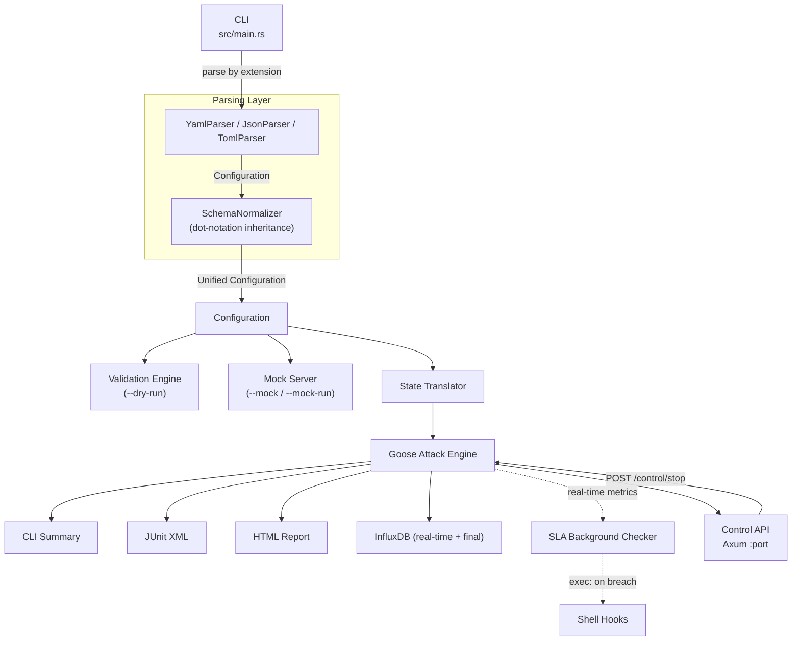
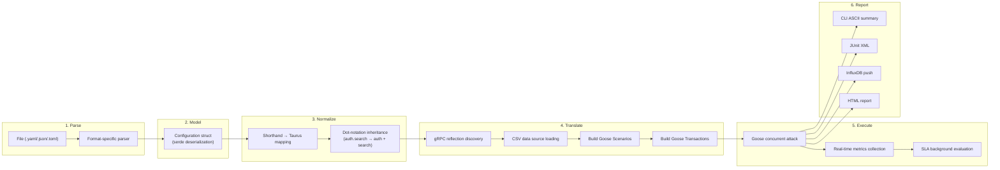
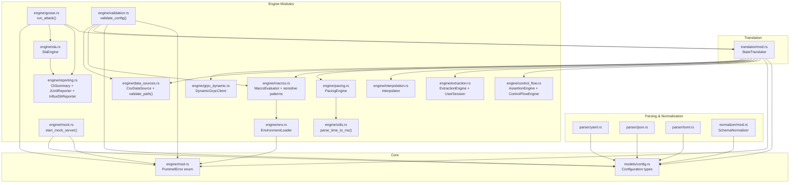
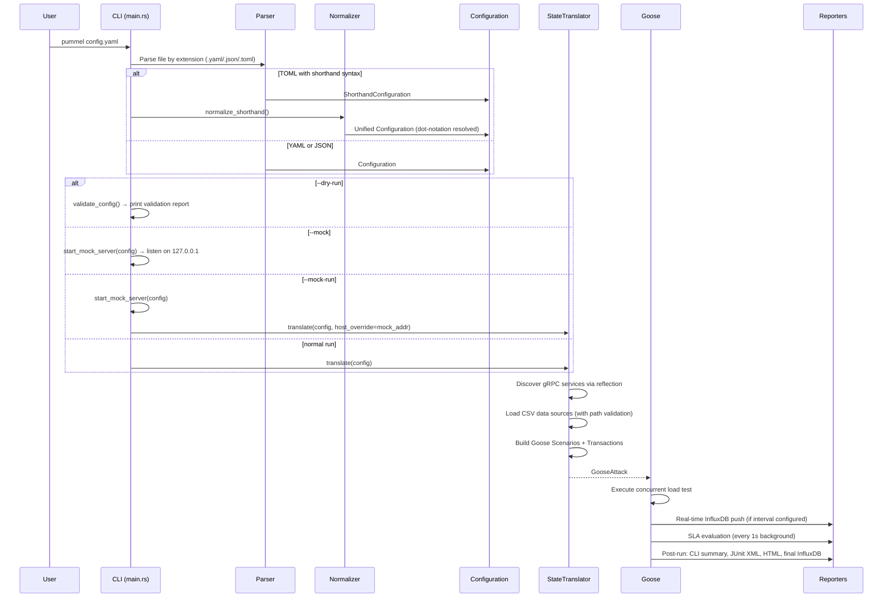
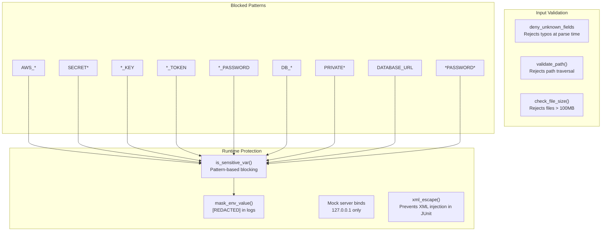

# pummel Architecture

`pummel` is a modular, high-throughput pipeline that transforms declarative performance specifications into concurrent asynchronous load generation tasks.

## System Overview

## Pipeline Detail

## Module Dependency Map

## Data Flow: Config File to Load Test

## Security Architecture

## Core Components

### 1. Multi-Format Parser & Normalizer

Supports **YAML**, **JSON**, and **TOML**. The normalizer resolves dot-notation inheritance (e.g., `auth.search`), ensuring that parent initialization requests are correctly injected as `on_start` steps in child scenarios.

### 2. Async Validation & Security

Performs a non-destructive dry-run of the configuration:
- **Path traversal checks**: Canonicalizes paths and verifies they stay within the project directory
- **File size limits**: Rejects data sources and body files exceeding 100 MB
- **Sensitive env var scanning**: Warns about `${env.AWS_SECRET_KEY}`, `${env.DB_PASSWORD}`, etc. during validation; **rejects** them at runtime
- **Struct validation**: `#[serde(deny_unknown_fields)]` on all config structs catches typos

### 3. Dynamic gRPC Engine

Uses `prost-reflect` and `tonic-reflection` for generic gRPC support:
- **Reflection Phase**: Queries the target server for service descriptors during translation
- **Generic Codec**: Dynamically serializes JSON payloads into binary Protobuf and deserializes responses
- **Streaming**: Supports unary, server-streaming, client-streaming, and bidirectional streaming

### 4. Async State Translator

The bridge between the static configuration and the dynamic Goose engine:
- **Session State**: Per-user `UserSession` with variable storage
- **Interpolation**: Real-time `${var}` substitution from session variables
- **Macro Evaluation**: Dynamic data generation (`${faker.email}`, `${uuid}`) and environment variable resolution with sensitive var blocking
- **Protocol Dispatch**: Routes traffic to HTTP, WebSocket, or gRPC clients

### 5. Real-Time Observability

- **InfluxDB Reporter**: Background task consuming metrics from shared state, flushing to InfluxDB at configurable intervals
- **CLI Summary**: Always-printed ASCII table with per-endpoint metrics (requests, failures, avg/p95/p99 latency)
- **JUnit XML**: Post-test XML report for CI/CD integration
- **Worker ID**: Each worker tagged with a UUID for correct metric aggregation in distributed runs

### 6. Logic & Extraction Engines

- **ControlFlowEngine**: Evaluates conditions (`==`, `!=`, `>`, `<`, `>=`, `<=`) with logical operators (`&&`, `||`)
- **AssertionEngine**: Validates responses against body content, HTTP status codes, with regex and negation support
- **ExtractionEngine**: Multi-engine variable capture using JSONPath, Regex, and XPath 2.0 (via `sxd-xpath`)

### 7. Integrated Mock Server

A multi-protocol test utility (Axum for HTTP/WebSocket, Tonic for gRPC) that:
- Binds to `127.0.0.1` only (never exposed externally)
- Generates responses from assertion definitions in the config
- Supports all four gRPC streaming modes
- Uses random ports for parallel test execution

### 8. Chaos Engineering Support

- **Shell Hook Executor**: `services` block with `prepare`, `startup`, `shutdown` phases; shutdown always runs
- **Real-Time SLA Actions**: Background thread evaluates metrics every 1 second; fires `exec:` commands on breach
- **Dynamic Control API**: Optional Axum HTTP server exposing `GET /metrics` and `POST /control/stop`

## Performance Profile

By leveraging Rust's `tokio` runtime and the Goose engine, `pummel` maintains a near-zero CPU/memory footprint compared to Java or Python-based alternatives, while providing significantly deeper protocol control. The `--mock-run` mode adds no measurable overhead to the hot path.
