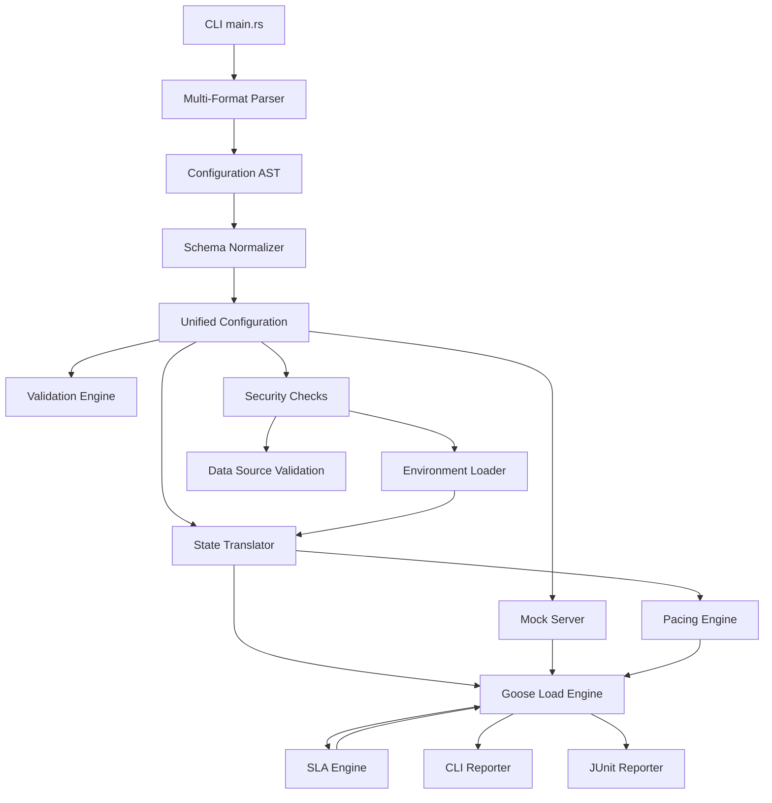

# bzt-rs Architecture

## Components

1. **CLI (main.rs)**: Parses 4 flags (`<CONFIG>`, `--dry-run`, `--mock`, `--mock-run`). Unimplemented distributed/metrics flags removed.
2. **Multi-Format Parser**: Deserializes YAML, JSON, and TOML into the unified Configuration model.
3. **Schema Normalizer**: Bridges "Shorthand" and Taurus schemas, resolves hierarchical scenario names.
4. **Config Model**: Supports `execution`, `scenarios`, `reporting` with Taurus fields: `label`, `headers`, `timeout`, `body-file`, `DataSourceDefinition` (simple path or structured).
5. **Validation Engine**: Performs dry-run checks for configuration and file dependencies.
6. **Security Checks**: Path traversal rejection, file size limits (100MB), sensitive env var masking (`AWS_*`, `SECRET*`, `KEY`, `TOKEN`, `PASSWORD`, `PRIVATE*`, `DATABASE_URL`), `deny_unknown_fields` on config structs, localhost-only mock bind.
7. **Mock Server**: Assertion-based HTTP mock server binding to `127.0.0.1`.
8. **Environment Loader** (`env.rs`): `${env.VAR}` resolution with priority chain (CLI > env > .env > defaults), sensitive var blocklist.
9. **Pacing Engine** (`pacing.rs`): Fixed-rate and randomized throughput enforcement.
10. **State Translator**: Maps unified config to dynamic Goose scenarios and tasks. Supports all standard HTTP methods (GET, POST, PUT, DELETE, PATCH, HEAD).
11. **Goose Load Engine**: High-performance Rust-based execution backend (Goose 0.18).
12. **SLA Engine** (`sla.rs`): Evaluates criteria (fail-rate, avg-response-time, p90/p95/p99, throughput) with Stop/Warn/Continue actions.
13. **CLI Reporter** (`reporting.rs`): Post-test ASCII summary table with per-endpoint metrics (requests, failures, avg/p95/p99 latency).
14. **JUnit Reporter**: XML report generation for CI/CD integration.
