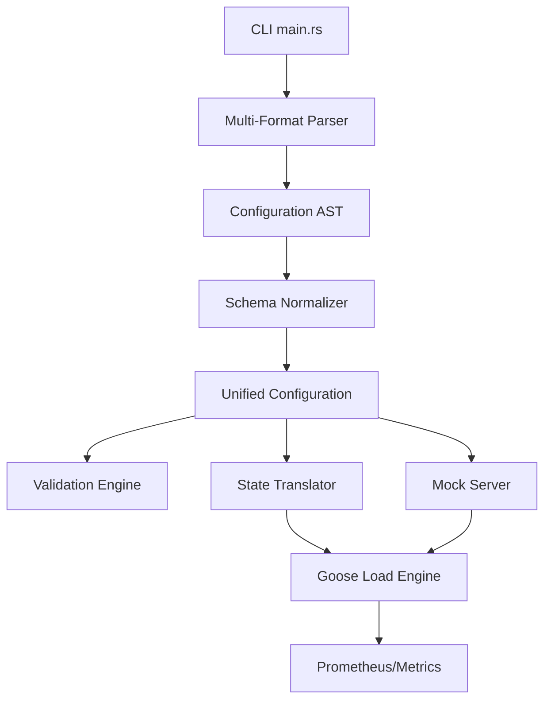

# bzt-rs Architecture

## Components

1. **Multi-Format Parser**: Deserializes YAML, JSON, and TOML.
2. **Schema Normalizer**: Bridges "Shorthand" and Taurus schemas.
3. **Validation Engine**: Performs dry-run checks for configuration and file dependencies.
4. **Mock Server**: Assertion-based HTTP mock server for functional testing.
5. **State Translator**: Maps AST to dynamic Goose scenarios and tasks.
6. **Goose Load Engine**: High-performance Rust-based execution.
